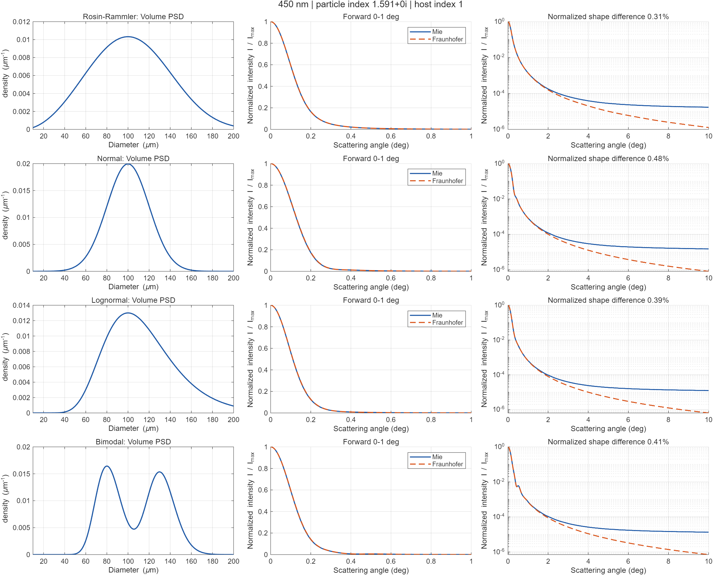
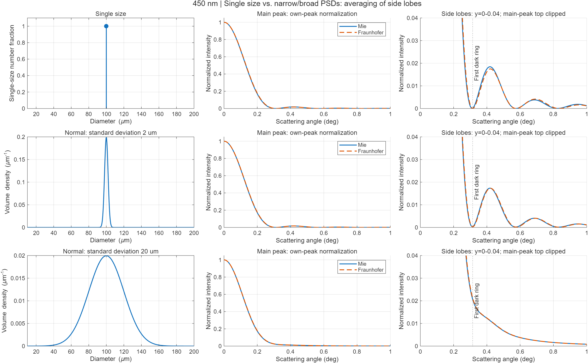

# Mie Scattering MATLAB

[GitHub repository](https://github.com/coder2423/mie-scattering-matlab) | [Download ZIP](https://github.com/coder2423/mie-scattering-matlab/archive/refs/heads/main.zip)

A MATLAB simulation for the angular scattering of homogeneous spheres and particle size distributions (PSDs), with a Fraunhofer diffraction comparison. The project provides physical differential cross sections, normalized intensity curves, peak diagnostics, and optional data/figure export.

Developed for learning and research in laser particle sizing. Mie theory and Fraunhofer diffraction are established physical models; this repository contributes an accessible MATLAB implementation and a reproducible comparison workflow.

## Quick start

Tested with **MATLAB R2025b**, using base MATLAB functions. No additional toolbox or Python installation is required to run the simulation or the bundled MATLAB tests. Other MATLAB releases and GNU Octave have not been verified.

Download or clone the repository, make its root the MATLAB current folder, and run:

```matlab
simulation = main_mie_scattering();
```

You can also open `main_mie_scattering.m` and click **Run**. It automatically adds `programs/` to the MATLAB path. The default run displays figures and **saves no files**.

To edit all simulation settings, open [default_scattering_config.m](programs/default_scattering_config.m). For a custom run:

```matlab
addpath('programs');
config = default_scattering_config();
config.wavelengths_nm = 632;
config.parameters.normal.Std = 10e-6;  % PSD length parameters are in meters.
config.distributionTypes = {'normal'};
simulation = main_mie_scattering(config);
```

Top-level overrides are also supported:

```matlab
simulation = main_mie_scattering(struct('makePlots', false, ...
    'showPeakDiagnostics', false));
```

Overrides replace entire top-level fields. For nested PSD changes, use the full configuration as in the first example. The main function validates settings before constructing the expensive scattering kernels.

## Default experiment and distributions

| Setting | Default |
|---|---|
| Vacuum wavelength | 450 and 632 nm |
| Absolute particle refractive index | 1.591, real and identical at both wavelengths |
| Nonabsorbing host refractive index | 1.0 |
| Diameter grid | 10-200 um, 401 uniformly spaced nodes |
| Angle grid | 0-10 degrees, 2001 uniformly spaced nodes |
| Distribution basis | Volume |
| Polarization | Unpolarized / complete uniform azimuth average |
| Display | Each model normalized to its own peak |
| Saving | Data off; figures off |

These are example inputs, not experimentally measured sample properties or a wavelength-dependent polystyrene dispersion model.

All PSDs are truncated and normalized within the configured diameter interval. Four built-in distributions are available:

| Type | Parameter fields | Default |
|---|---|---|
| `rr` (Rosin-Rammler) | `Mode` or `Scale`; `Shape` | Mode 100 um, shape 3 |
| `normal` | `Mean`; `Std` | Mean 100 um, standard deviation 20 um |
| `lognormal` | `Mode` or `Median`; `LogSigma` | Mode 100 um, log-width 0.30 |
| `bimodal` | `Modes` or `Medians`; `LogSigmas`; `VolumeFractions` | Component modes 80/130 um, log-widths 0.15/0.10, shares 0.5/0.5 |

PSD length parameters use **meters**, even though the configuration grid ranges use um. Log-widths are standard deviations of `ln(d)`. Do not set both mode and scale/median representations. The two bimodal components are individually normalized before mixing, so their shares refer to the truncated interval. The legacy field `VolumeFractions` specifies shares in the selected basis: with `distributionBasis='number'`, they are number shares.

## Plots and saving

Each wavelength produces a comparison figure with three columns: the original PSD, the forward peak, and the scattering tail. All diameter and angle **x axes are linear**. The tail **y axis** is logarithmic by default; set `intensityYScale='linear'` to change it.

Peak diagnostics compare a single 100 um diameter with normal PSDs of standard deviations 2 and 20 um. Side-lobe panels zoom the same normalized data without filtering or adding peaks. Broad PSDs fill in the minima of different diameters, which can remove visible side lobes from the ensemble curve.

Display options:

| `plotQuantity` | Meaning |
|---|---|
| `own_peak` | Each ensemble curve divided by its own maximum; compares shape |
| `common_peak` | Both curves divided by the Mie maximum; preserves amplitude differences |
| `dcs` | Mean per-particle differential cross section, m^2/sr |
| `irradiance` | Scattered irradiance, W/m^2; requires `totalNumber` |

```matlab
config = default_scattering_config();
config.saveData = true;       % CSV and MAT
config.saveFigures = false;  % PNG and editable MATLAB FIG
simulation = main_mie_scattering(config);
```

The switches are independent. Figure saving requires `makePlots=true`; use `figureVisible='off'` for invisible batch export. You can save an already computed simulation without rerunning it:

```matlab
save_scattering_data(simulation);
```

The default output is `results/model_comparison/`. Explicit saving overwrites matching filenames. Outputs include PSD CSVs, angular CSVs with physical and normalized quantities, `comparison_metrics.csv`, and `simulation_results.mat`. Generated outputs are ignored by Git. Decimal wavelengths use sufficient precision in filenames to avoid collisions from `%g` rounding.

## Single spheres and custom PSDs

The reusable APIs use **meters**, **radians**, and absolute refractive indices:

```matlab
addpath('programs');
theta = linspace(0, pi, 2001).';
sphere = mie_single_sphere(theta, 100e-6, 450e-9, 1.591, 1.0);
plot(theta*180/pi, sphere.differentialCrossSection);
xlabel('Scattering angle (deg)'); ylabel('Differential cross section (m^2/sr)');
```

For a measured or custom volume PSD:

```matlab
d = linspace(10, 200, 401).'*1e-6;
theta = linspace(0, 10, 2001).'*pi/180;
psd = generate_particle_distribution(d, 'normal', ...
    struct('Mean', 100e-6, 'Std', 20e-6));
opt = struct('DistributionBasis', 'volume', 'DistributionSampling', 'density');
mie = mie_distribution_forward(theta, d, psd.density, 450e-9, 1.591, 1, opt);
diffraction = fraunhofer_distribution_forward(theta, d, psd.density, ...
    450e-9, 1, opt, 'sphere');
```

`DistributionSampling='density'` means a density **per meter of diameter**, integrated using trapezoidal quadrature on strictly increasing nodes. A density per um must be multiplied by `1e6` to obtain a density per meter. Use `'bin'` when inputs are already integrated bin fractions; do not multiply by bin width again. A single-diameter PSD must use `'bin'`.

For a volume PSD, effective number weights are proportional to `fV(d)/d^3` (including quadrature weights for density samples). The ensemble sums the **unnormalized physical single-particle kernels**. It never normalizes each diameter's angular response before integration.

| Output field | Meaning |
|---|---|
| `S1`, `S2` (single sphere) | Raw perpendicular / parallel complex amplitudes |
| `Qext`, `Qsca`, `Qabs`, `Qback`, `g` (single sphere) | Efficiencies and asymmetry parameter |
| `kernel` (PSD API) | Angle-by-diameter physical differential-cross-section matrix |
| `numberFractions` | Normalized effective number weights |
| `differentialCrossSection` | Mean per-particle angular cross section, m^2/sr |
| `relativeIntensity` | Differential cross section divided by its grid maximum |
| `distributionKernel` | Kernel including quadrature and volume-to-number factors |
| `numberScale` | Sum of unnormalized effective weights; not actual particle count |
| `phaseFunction` (Mie) | Unpolarized phase function; integral over 4*pi is one for nonzero scattering |
| `irradiance` | Optional `IncidentIrradiance*TotalNumber*dcs/Distance^2` |
| `cacheKey`, `cacheHit` | Optical/grid identity and reuse status |

`distributionKernel*psd/numberScale` equals the mean differential cross section. Both PSD APIs accept a previous result as their last argument to reuse a kernel when only the PSD or absolute scaling changes. The main workflow builds each model's grid kernel once per wavelength.

## Physical conventions and limits

- The time convention is `exp(+i*omega*t)`, with outgoing `h_n^(2)` and passive index `n-i*kappa`. Positive imaginary particle indices are rejected.
- `lambda0` is the vacuum wavelength; `k=2*pi*nMedium/lambda0`, `m=nParticle/nMedium`, and `x=pi*nMedium*d/lambda0`.
- Mie applies to homogeneous, isotropic, nonmagnetic spheres in a real, nonabsorbing host. The implementation supports `x=0` or `1e-6 <= x <= 1e4`; zero diameter is allowed only in the single-sphere API.
- The single-sphere Mie API accepts angles from 0 to pi. The scalar Fraunhofer API accepts the forward hemisphere, `0 <= theta < pi/2`, but its physical approximation is intended for large-particle **small-angle** scattering. Size alone does not ensure agreement, particularly near index matching.
- `Polarization` supports `unpolarized`, `parallel`, `perpendicular`, and `linear` in the Mie PSD API. `Azimuth` is the angle of incident E relative to the local scattering plane, scalar or one value per angle. Fraunhofer accepts these fields as metadata and remains scalar.
- Ensemble intensity addition assumes single scattering, negligible electromagnetic coupling/attenuation, and averaging that suppresses interparticle cross terms away from the coherent forward cone. The model does not simulate fixed-configuration speckle or multiple scattering.
- The independent-particle kernel at exactly zero angle is not the total on-axis signal containing direct light and coherent interference. A detector requires its actual accepted-solid-angle integral and optical transfer; replacing distance by focal length is insufficient.
- The comparison metrics require nonzero Mie scattering. For exactly index-matched spheres, use the single-sphere or PSD API; the main comparison rejects undefined relative errors.

Peak-normalized shape differences, physical angular L2 differences, and cone-integral differences are separate quantities. The L2 metrics integrate over angle; cone cross sections integrate with `2*pi*sin(theta)`. Agreement between peak-normalized plots does not establish agreement in absolute power, scattering tails, or inverse-reconstruction accuracy.

## Verification

```matlab
addpath('tests');
report = run_all_tests();
```

The suite covers 54 pinned miepython single-sphere cases and one volume-PSD case, complex coefficients/amplitudes, energy conservation, the optical theorem, angular integration, the Rayleigh limit, PSD analytic CDFs, a circular-aperture diffraction integral, side lobes, cache reuse, invalid settings, and all four independent export combinations. Tests use temporary output directories and do not overwrite the fixtures.

The bundled JSON fixture was generated with miepython 3.3.0 at commit [`f4101f71aa6fbbf8a8e835b45778cee1b5cb637b`](https://github.com/scottprahl/miepython/tree/f4101f71aa6fbbf8a8e835b45778cee1b5cb637b). Numerical consistency tests are not experimental validation of a material, sample, or instrument.

Optional grid-refinement checks require a saved simulation and recompute the kernels:

```matlab
check_scattering_grid_convergence('diameter');
check_scattering_grid_convergence('angle');
```

Refine sampling when changing size range, wavelength, angle range, or distribution width. Reported grid changes are sampling diagnostics, not universal error bounds.

For angle-dependent linear-polarization azimuth, angle refinement interpolates its unwrapped pi-periodic direction onto the refined grid. This is an explicit interpolation of the supplied direction samples, not a new optical model.

An unexecuted GitHub Actions workflow is included using the official [MATLAB setup](https://github.com/matlab-actions/setup-matlab) and [run-command](https://github.com/matlab-actions/run-command) actions. It runs the same suite on Linux after publication; the local verification environment is Windows. Public-repository base-MATLAB workflows can use the action's licensing arrangement; private repositories may require a batch licensing token as described in its documentation.

To regenerate the fixture, clone miepython to a separate external directory, check out the exact commit above, install `tools/requirements-reference.txt` in a Python environment, and run:

```text
python tools/generate_miepython_reference.py --miepython-source /path/to/miepython
```

The generator verifies the Git commit before writing `tests/fixtures/miepython_reference.json`. Python is only needed for regeneration. The full upstream source tree is not bundled here.

## Repository layout

```text
main_mie_scattering.m    Main entry: configuration, orchestration, plots, save controls
programs/               Numerical kernels, PSDs, plotting, export and convergence checks
tests/                  MATLAB validation suite and pinned JSON fixture
tools/                  Optional Python fixture generator
assets/                 English example plots generated from this implementation
third_party/            Preserved miepython MIT license
.github/workflows/      MATLAB CI configuration
```

## Example plots



The corresponding [632 nm comparison](assets/comparison_632nm.png) is also included.



## References, acknowledgments and license

This project was developed with reference to [Scott Prahl's miepython](https://github.com/scottprahl/miepython), its [algorithm documentation](https://miepython.readthedocs.io/en/latest/07_algorithm.html), and the established scattering literature:

- Mie, G. (1908). *Beitrage zur Optik truber Medien, speziell kolloidaler Metallosungen*. [doi:10.1002/andp.19083300302](https://doi.org/10.1002/andp.19083300302).
- Bohren, C. F., and Huffman, D. R. *Absorption and Scattering of Light by Small Particles*. [Wiley](https://onlinelibrary.wiley.com/book/10.1002/9783527618156).
- Mishchenko, M. I., Travis, L. D., and Lacis, A. A. (2002). *Scattering, Absorption, and Emission of Light by Small Particles*. [Author-provided electronic edition](https://www.giss.nasa.gov/pubs/books/2002_Mishchenko_mi06300n/).
- Wiscombe, W. J. (1980). *Improved Mie scattering algorithms*. [doi:10.1364/AO.19.001505](https://doi.org/10.1364/AO.19.001505).
- Bohren, C. F. *Atmospheric Optics*, circular-disk diffraction expressions (32)-(33). [Publisher chapter](https://www.wiley-vch.de/books/sample/3527403205_c01.pdf#page=27).

AI tools assisted with code development, documentation, and review. The implementation is checked through the numerical and physical tests above; AI assistance is not itself evidence of correctness.

Released under the [MIT License](LICENSE). Upstream attribution and its preserved license are recorded in [NOTICE](NOTICE) and [third_party/miepython_LICENSE.txt](third_party/miepython_LICENSE.txt).

Contributions are welcome: describe the physical conditions, units and a minimal reproducible example when reporting a problem. Changes to numerical behavior should include a reference or physical-identity check. This repository currently provides a forward simulation, not a particle-size inversion algorithm or a GUI.
